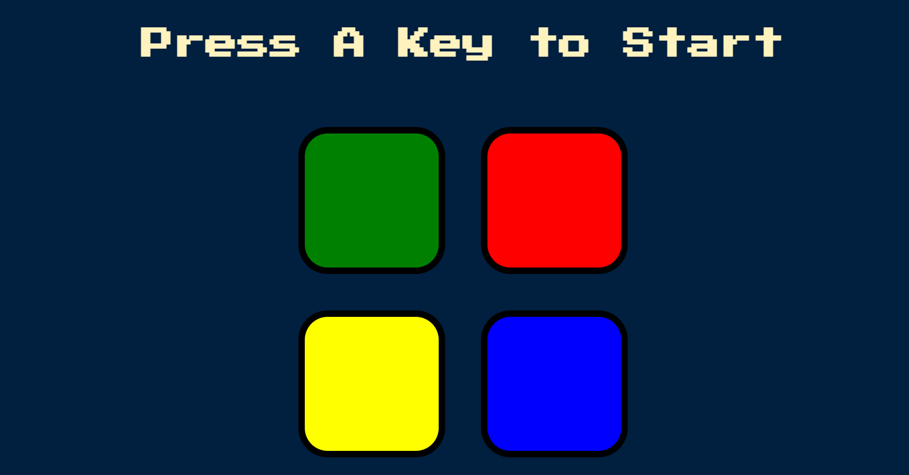

# Simon Game 🏅

## Introduction

The Simon Game is a classic memory game where players must repeat a sequence of colors and sounds generated by the computer. The goal is to match the increasingly longer sequences as the game progresses. Once the user fails to repeat the required sequence, the game is over. This implementation allows users to play the Simon Game in their web browser. 

## Rules

To play the Simon Game, follow these steps:

1. You will see a title "Press A Key to Start" and four colored buttons 🟢🔴🟡🔵.

2. Press any key on your keyboard to start the game.

3. Pay attention to the sequence of colors and sounds played by the computer.

4. Click on the buttons to repeat the sequence in the same ORDER.

5. If you successfully repeat the sequence, the game will advance to the next level, and a new color will be added to the sequence.

6. Continue to repeat the sequences to increase your score.

7. If you make a mistake, the game will end, and you can restart by pressing any key again.

Enjoy testing your memory with the Simon Game!

## Features

- Classic Simon Game implementation.
- Interactive gameplay with Visual and Auditory feedback.
- Colorful buttons representing different game elements.
- Sound effects for each button press and sequence.
- Increasing difficulty levels as the game progresses.

## Snap

## Demo

Play this [Game](https://alokverma18.github.io/Simon-Game/)

## Connect 

## 
### Leave a 🌟 if it was Helpful!!
### Thanks!

